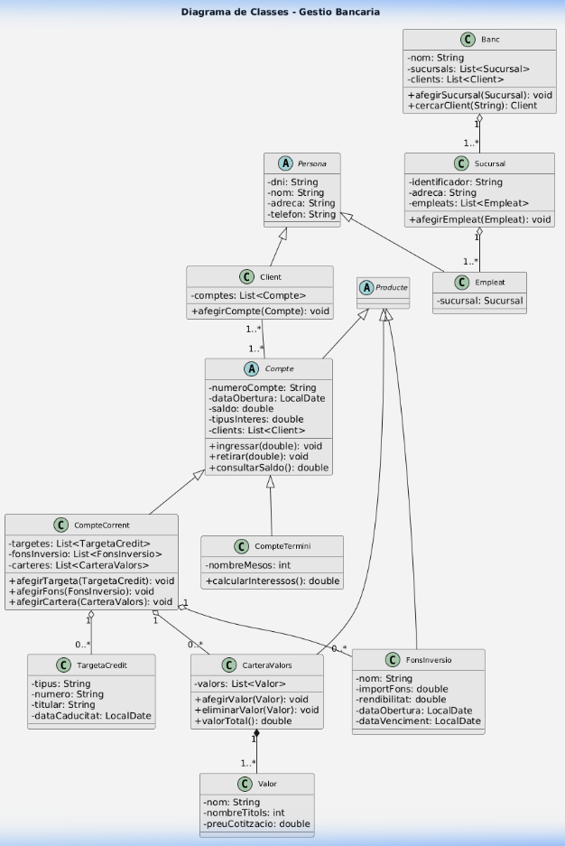

# 🏦 Gestió Bancària - Pràctica de Disseny Orientat a Objectes

## Descripció

Projecte Java complet que modela un sistema de **gestió bancària** com a pràctica de la unitat formativa de **Disseny Orientat a Objectes (DOO)**. El projecte inclou l'anàlisi gramatical (mètode Booch), la justificació de classes i relacions, la implementació de totes les classes del model, els diagrames UML i la documentació JavaDoc.

## Autor

- **Nom**: Alumne
- **Context**: Pràctica de Disseny Orientat a Objectes (DOO)
- **Data**: Maig 2026

## Estructura del repositori

```
gestio-bancaria/
├── src/
│   └── model/
│       ├── Persona.java          # Classe abstracta - superclasse de Client i Empleat
│       ├── Client.java           # Client del banc amb comptes associats
│       ├── Empleat.java          # Empleat del banc assignat a una sucursal
│       ├── Sucursal.java         # Oficina bancària amb empleats
│       ├── Producte.java         # Classe abstracta - superclasse de productes bancaris
│       ├── Compte.java           # Classe abstracta - compte bancari genèric
│       ├── CompteCorrent.java    # Compte amb targetes, fons i carteres
│       ├── CompteTermini.java    # Compte amb durada fixada en mesos
│       ├── TargetaCredit.java    # Targeta de crèdit (Visa, MasterCard...)
│       ├── FonsInversio.java     # Fons d'inversió amb rendibilitat
│       ├── CarteraValors.java    # Cartera composta per valors borsaris
│       ├── Valor.java            # Títol borsari dins una cartera
│       └── Banc.java             # Entitat principal del sistema
├── diagrames/
│   ├── diagrama-classes.puml     # Diagrama de classes UML complet
│   ├── casos-us.puml             # Diagrama de casos d'ús
│   ├── sequencia.puml            # Diagrama de seqüència
│   ├── comunicacio.puml          # Diagrama de comunicació
│   └── activitat.puml            # Diagrama d'activitat
├── documentacio/                 # JavaDoc generat (HTML)
├── docs-practica/
│   ├── analisi-gramatical.md     # Anàlisi gramatical (mètode Booch)
│   ├── justificacio-classes.md   # Justificació de classes i relacions
│   └── patrons-disseny.md        # Estudi de patrons de disseny
├── README.md                     # Aquest fitxer
└── generar-javadoc.sh            # Script per generar la documentació JavaDoc
```

## Tecnologies utilitzades

| Tecnologia | Versió | Ús |
|---|---|---|
| **Java** | 17+ | Llenguatge de programació del model |
| **PlantUML** | 1.2024+ | Generació de diagrames UML |
| **JavaDoc** | (inclòs al JDK) | Generació de documentació HTML |
| **Markdown** | — | Documentació de la pràctica |

## Compilació

Per compilar totes les classes Java:

```bash
# Crear la carpeta de sortida
mkdir -p bin

# Compilar totes les classes
javac -d bin src/model/*.java
```

## Generació de JavaDoc

Per generar la documentació JavaDoc en format HTML:

```bash
# Opció 1: Executar l'script
chmod +x generar-javadoc.sh
./generar-javadoc.sh

# Opció 2: Executar manualment
javadoc -d documentacio -sourcepath src -subpackages model -encoding UTF-8 -charset UTF-8 -author -version
```

Un cop generat, obre `documentacio/index.html` al navegador per consultar la documentació.

## Renderització de diagrames PlantUML

### Opció 1: Línia de comandaments (cal Java i el JAR de PlantUML)

```bash
# Descarregar PlantUML si no el tens
# wget https://github.com/plantuml/plantuml/releases/download/v1.2024.3/plantuml-1.2024.3.jar

# Generar tots els diagrames
java -jar plantuml.jar diagrames/*.puml
```

### Opció 2: Online

Copia el contingut dels fitxers `.puml` a [https://www.plantuml.com/plantuml](https://www.plantuml.com/plantuml) per visualitzar i descarregar les imatges PNG.

### Opció 3: Extensions d'IDE

- **VS Code**: Extensió "PlantUML" de jebbs
- **IntelliJ IDEA**: Plugin "PlantUML Integration"

## Diagrama de classes



*Si la imatge no es veu, genera-la amb PlantUML a partir del fitxer `diagrames/diagrama-classes.puml`.*

## Apartats de la pràctica

| # | Apartat | Document |
|---|---|---|
| 1 | Anàlisi gramatical (Mètode Booch) | [analisi-gramatical.md](docs-practica/analisi-gramatical.md) |
| 2 | Justificació de classes i relacions | [justificacio-classes.md](docs-practica/justificacio-classes.md) |
| 3 | Codi Java amb JavaDoc | [src/model/](src/model/) |
| 4 | Documentació JavaDoc (HTML) | [documentacio/](documentacio/) |
| 5 | Diagrames UML (PlantUML) | [diagrames/](diagrames/) |
| 6 | Patrons de disseny | [patrons-disseny.md](docs-practica/patrons-disseny.md) |

## Jerarquia de classes

```
Persona (abstracta)
├── Client
└── Empleat

Producte (abstracta)
├── Compte (abstracta)
│   ├── CompteCorrent
│   └── CompteTermini
├── FonsInversio
└── CarteraValors
    └── Valor (composició)

Banc ◇── Sucursal ◇── Empleat
CompteCorrent ◇── TargetaCredit
CompteCorrent ◇── FonsInversio
CompteCorrent ◇── CarteraValors
CarteraValors ◆── Valor
Client ── Compte (associació N:M)
```

## Llicència

Aquest projecte és una pràctica acadèmica. Tot el codi i documentació es proporciona amb finalitats educatives.

---

*Pràctica de Disseny Orientat a Objectes (DOO) - Curs 2025-2026*
